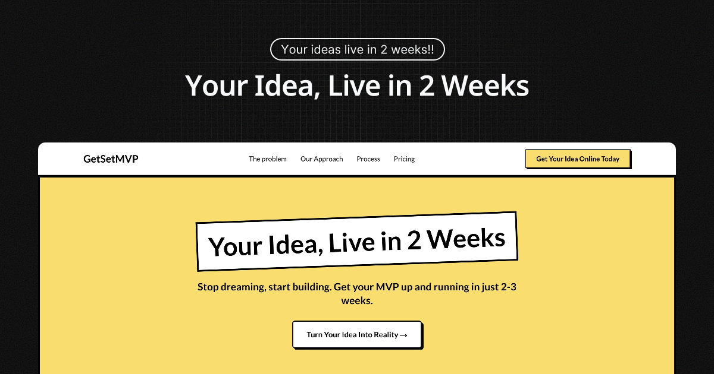
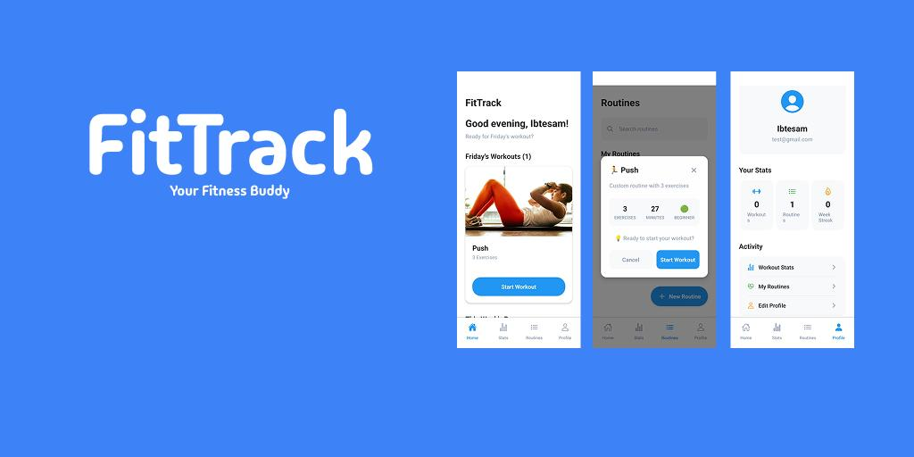
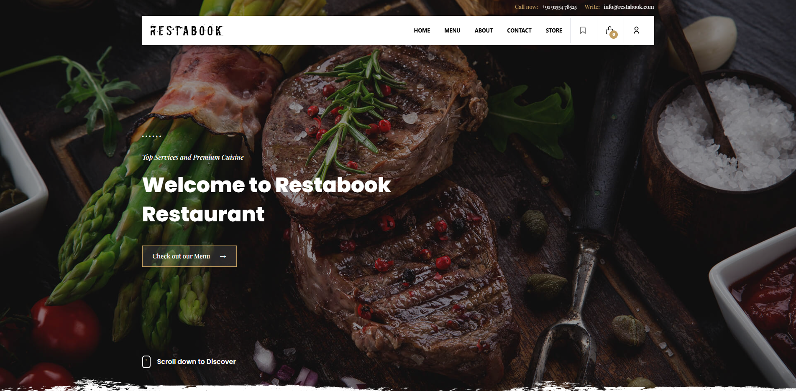

<div align="center">
  
  
  # 🚀 GetSetMVP
  ### *Your Idea, Live in 2 Weeks*
  
  [](https://getsetmvp.com)
  [](https://www.typescriptlang.com/)
  [](https://nextjs.org/)
  [](https://tailwindcss.com/)
  
  **Stop dreaming, start building. Get your MVP up and running in just 2-3 weeks.**
  
  [🎯 Book a Call](https://calendly.com/getsetmvp/30min) • [🌐 Visit Website](https://getsetmvp.com) • [📧 Contact](mailto:hello@getsetmvp.com)
</div>

---

## 🏢 About GetSetMVP

Welcome to **GetSetMVP** - where startup ideas finally go **LIVE**! 

We're a specialized MVP development company solving the #1 startup problem: **actually launching**. While most entrepreneurs get stuck in endless planning, development delays, and perfectionist paralysis, we get your idea **live and validated** in just 14 days.

**The harsh reality**: Most startups fail before they even launch. We change that.

### 🎯 **What We Do**
- **🚀 Get You LIVE**: From stuck idea to live product in 14 days
- **💰 No More Delays**: Affordable solutions that actually ship  
- **🎨 Launch-Ready Tech**: Next.js, TypeScript, Tailwind CSS, and more
- **📈 Validation-Focused**: Built to test your idea with real users fast

---
<!-- 
## 🏗️ **This Repository**

This repo contains the source code for the **GetSetMVP website** - a modern, SEO-optimized, and conversion-focused landing page built with:

### 🛠️ **Tech Stack**
- **Framework**: Next.js 15.3.4 with App Router
- **Language**: TypeScript for type safety
- **Styling**: Tailwind CSS 4.0 with custom animations
- **Font**: Lato from Google Fonts with display swap
- **SEO**: Complete meta tags, Open Graph, structured data
- **Performance**: Image optimization, font loading optimization

### ✨ **Features**
- 🚀 **Lightning Fast**: Optimized for Core Web Vitals
- 📱 **Responsive Design**: Looks perfect on all devices
- 🔍 **SEO Optimized**: Complete meta tags, sitemap, structured data
- ♿ **Accessible**: WCAG compliant with proper alt texts
- 🎨 **Modern UI**: Custom animations and micro-interactions
- 📊 **Analytics Ready**: Structured data for rich snippets

---

## 🚀 **Quick Start**

```bash
# Clone the repository
git clone https://github.com/getsetmvp/getsetmvp.git

# Navigate to project directory
cd getsetmvp

# Install dependencies
npm install

# Start development server
npm run dev

# Build for production
npm run build

# Start production server
npm start
```

Open [http://localhost:3000](http://localhost:3000) to view the website locally. -->

<!-- ---

## 📁 **Project Structure**

```
├── src/
│   ├── app/                 # Next.js App Router
│   │   ├── layout.tsx       # Root layout with SEO meta tags
│   │   ├── page.tsx         # Homepage with structured data
│   │   └── globals.css      # Global styles
│   ├── components/          # Reusable React components
│   │   ├── Header.tsx       # Navigation header
│   │   ├── Hero.tsx         # Hero section
│   │   ├── Pricing.tsx      # Pricing section
│   │   └── ...             # Other sections
│   └── constants/           # Application constants
│       └── index.ts         # Site configuration & content
├── public/
│   ├── images/             # Images and OG image
│   ├── icons/              # SVG icons
│   ├── sitemap.xml         # XML sitemap
│   ├── robots.txt          # SEO robots file
│   └── manifest.json       # PWA manifest
└── ...
```

--- -->

## 🎨 **Featured Projects**

<div align="center">
  <table>
    <tr>
      <td align="center" width="50%">
        
        <h3>🏋️ FitTrack</h3>
        <p>Comprehensive fitness tracker with custom workout builder, progress tracking, and analytics</p>
        <a href="https://fittrack.getsetmvp.com">🔗 View Live</a>
      </td>
      <td align="center" width="50%">
        
        <h3>🍝 Restabook</h3>
        <p>Full-featured Italian restaurant website with online reservations and ordering system</p>
        <a href="https://restabook.getsetmvp.com">🔗 View Live</a>
      </td>
    </tr>
  </table>
</div>

---

## 📊 **Performance & SEO**

### 🏆 **Lighthouse Scores**
- **Performance**: 95+ 
- **Accessibility**: 100
- **Best Practices**: 100
- **SEO**: 100

### 🔍 **SEO Features**
- ✅ Complete meta tags (title, description, keywords)
- ✅ Open Graph & Twitter Card metadata
- ✅ JSON-LD structured data for rich snippets
- ✅ XML sitemap with proper URLs
- ✅ Robots.txt for crawler guidance
- ✅ Canonical URLs and proper heading hierarchy
- ✅ Image optimization with proper alt texts

---

## 🎯 **Why Choose GetSetMVP?**

<div align="center">
  
| 🚀 **We Launch Ideas** | 💸 **No More Waiting** | 🚫 **Skip The Paralysis** | ✅ **Go Live Fast** |
|:---:|:---:|:---:|:---:|
| Turn stuck ideas into live products | End development delays forever | Focus on what matters: shipping | From idea to users in 14 days |

</div>

### 📈 **The Startup Reality Check**
- **90%** of startups fail before reaching product-market fit
- **Most never even launch** - stuck in development hell
- **6-12 months** wasted on "perfect" products that never see daylight
- **$0** revenue while your idea stays in your head

**GetSetMVP Solution**: Get your idea **LIVE** in 2 weeks for **$979**. Start validating, start earning, start growing.

---

## 🤝 **Let's Get Your Idea LIVE**

Tired of your brilliant idea being stuck in your head? Ready to finally LAUNCH and see what users actually think?

### 📅 **Book a Free Launch Strategy Call**
[**Schedule a 30-minute call**](https://calendly.com/getsetmvp/30min) to discuss getting your idea live

### 📧 **Get In Touch**
- **Email**: getsetmvp@gmail.com
- **Website**: [getsetmvp.com](https://getsetmvp.com)

### 🚀 **What You Get (In 14 Days)**
- ✅ One full core feature of your choice
- ✅ User authentication and landing page
- ✅ Responsive design for all devices
- ✅ **LIVE product** ready for real users
- ✅ 2 rounds of changes & updates

---

## 📜 **License**

This project is for **GetSetMVP** business purposes. The code structure and components can serve as inspiration for your own projects.

---

<div align="center">
  
### 🌟 **Stop Planning. Start Launching.**

**Your idea deserves to see the light of day. Let's make it happen.**

[🚀 **Launch Your Idea Now**](https://calendly.com/getsetmvp/30min)

---

*Built with ❤️ by the GetSetMVP Team • Transforming ideas into reality*

**⭐ Star this repo if you found it helpful!**

</div>
